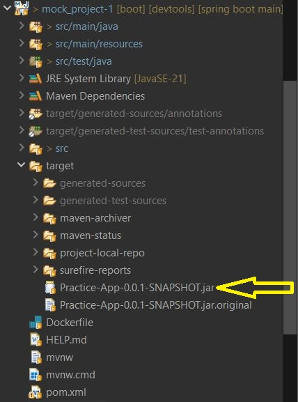

# Simple Spring Boot Project with Docker Application:

- Build the image using the following command:

```http
   $ docker build -t img-name .
```

- Run the Docker container using the command-Line shown below:

```http
   $ docker tag  img-name xman0869/container-name
```

- Push the Docker image in Docker Hub:

```http
   $ docker push  xman0869/container-name
```


## STEPS: 
### Project Commands
```
mvn clean package
```


Run without selecting a server :
```
mvn spring-boot:run
OR
java -jar target/Practive-App-0.0.1-SNAPSHOT.jar
```

2. create Dockerfile
### AWS Linux Machine Commands
3. install git:
```
   sudo yum install git
```
4. Install Java 21 and maven:
```
   sudo yum install java-21-amazon-corretto-devel
   sudo yum install maven
```
```
sudo alternatives --config java -> Check how many version downloads
```

5. clone project
```
   git clone <repositoy-url>
```
6. change directory to project directory
```
   cd <project-name>
```

7. Package Maven application -> target folder created
```
   mvn clean package
```
8. Now build image
```http
   $ docker build -t img-name .
```

9. Create contiainer
```http
   $ docker run -d -p 8080:8080 img-name      // Detached mode
```

#### The application will be accessible by URL: <host-public-ip(AWS)>:<host-ip(AWS)>/context-path
---

## Some Linux Command: 
### apt: ubuntu | yum: linux
1. list files and directories
```http
   $ ls -l
```

2. Clean terminal screen
```http
   $ clear
```

3. cd (Change Directories) 
```http
   $ cd <path/>           -> navigate forword directories
   $ cd ..                -> navigate backword one level
   $ cd /                 -> root level
```

4. Check current location:
```http
   $ pwd
```

5. Remove:
```http
   $ rm <file name>          -> Delete File
   $ rm -r <directory>       -> Remove Directory
   $ rmdir  <directory>      -> Remove file
```

6. create new directory:
```http
   $ mkdir <directory>   
```

7. create empty file without opening editor
```http
   $ touch file.txt
```

8. View the content on file
```http
   $ cat <file-name>
```

9. Write/Editable mode in files
```http
   $ vi Docker         -> simple text
         a. i        for insert 
         b. esc      go out form writing mode
         c. :wq      save and exit
         d. :q!      without save exit

   $ vim docker-compose.yaml        -> code formate/Syntax
         a. i        for insert 
         b. esc      go out form writing mode
         c. :wq      save and exit
         d. :q!      without save exit
```

10. Download software:
```http
   $ sudo yum/apt install <git>          ->  Download package
   $ sudo yum remove <package>           ->  remove package
   $ sudo yum update                     -> Update packages


```

11. Refresh: (with logout)
```http
   $ source ~/.bashrc
```

```
   ls           -> list
   cd           -> change Directory
   sudo         -> Super user do
   apt          -> used to update software (sudo apt update)
```
